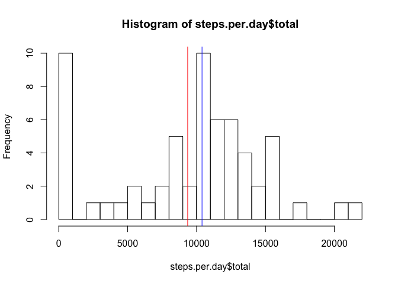
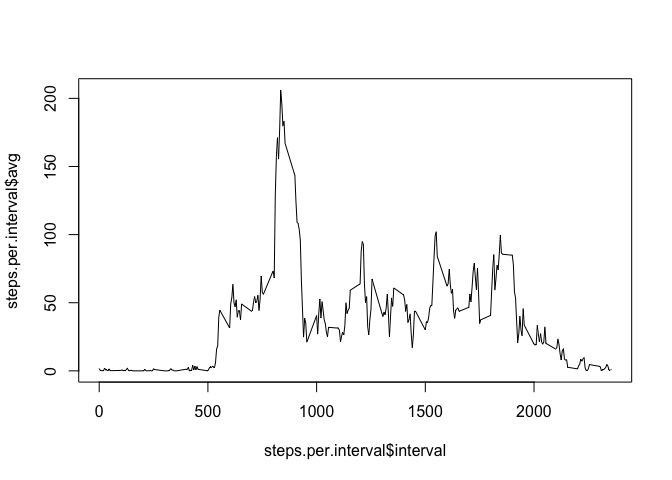
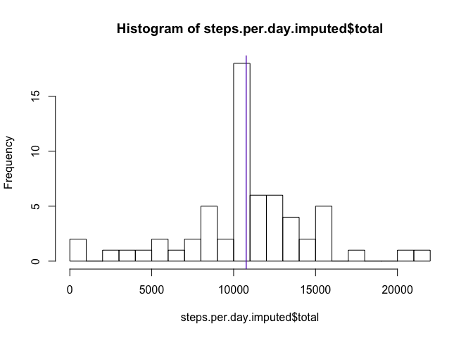
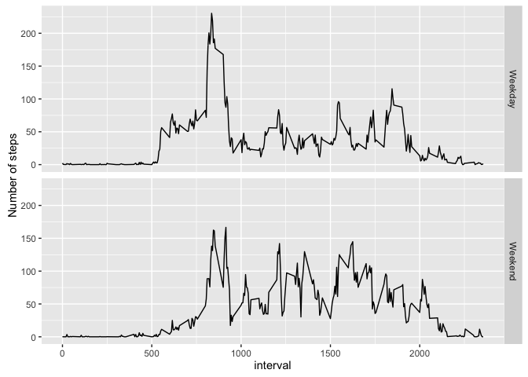

# Reproducible Research: Peer Assessment 1


## Loading and preprocessing the data

```r
data <- read.csv(unz("activity.zip", "activity.csv"))
```

## What is mean total number of steps taken per day?

```r
library(plyr)

# Calculate the total number of steps taken per day
steps.per.day <- ddply(data, .(date), summarise, total = sum(steps, na.rm = T))

# Calculate the mean and median of the total number of steps taken per day
steps.mean <- mean(steps.per.day$total, na.rm = T)
steps.median <- median(steps.per.day$total, na.rm = T)
```

The steps mean is 9354.2295082. The median is 10395.

```r
# Make a histogram of the total number of steps taken each day
hist(steps.per.day$total, breaks = 30)
abline(v = steps.mean, col = "red")
abline(v = steps.median, col = "blue")
```



## What is the average daily activity pattern?

```r
# Calculate the average number of steps taken per time interval
steps.per.interval <- ddply(data, .(interval), summarise, avg = mean(steps, na.rm = T))

# Which 5-minute interval, on average across all the days in the dataset, contains the maximum number of steps?
interval.max.steps <- steps.per.interval[which.max(steps.per.interval$avg),]
```

The 5-minute interval with the maximum number of steps (on average across all days in data set)
is 835, with 206.1698113 steps on average.


```r
# Make a time series plot (i.e. 𝚝𝚢𝚙𝚎 = "𝚕") of the 5-minute interval (x-axis) and the average number of steps taken, averaged across all days (y-axis)
plot(steps.per.interval$interval, steps.per.interval$avg, type = "l")
```



## Imputing missing values

```r
# Calculate and report the total number of missing values in the dataset (i.e. the total number of rows with 𝙽𝙰s)
missing.values <- sum(is.na(data$steps))
```

There are 2304 missing values.


```r
# Fill-in missing values with the mean for that 5-minute interval.
data.imputed <- data
for(i in 1:nrow(data.imputed)){
    if(is.na(data.imputed$steps[i])){
        interval.needed <- data.imputed$interval[i]
        data.imputed$steps[i] <- steps.per.interval[steps.per.interval$interval == interval.needed, 2]
    }
}

# Calculate the total number of steps taken per day
steps.per.day.imputed <- ddply(data.imputed, .(date), summarise, total = sum(steps))

# Calculate the mean and median of the total number of steps taken per day
steps.mean.imputed <- mean(steps.per.day.imputed$total)
steps.median.imputed <- median(steps.per.day.imputed$total)
```

The new steps mean is 1.0766189\times 10^{4}. The new median is 1.0766189\times 10^{4}.


```r
# Make a histogram of the total number of steps taken each day
hist(steps.per.day.imputed$total, breaks = 30)
abline(v = steps.mean.imputed, col = "red")
abline(v = steps.median.imputed, col = "blue")
```



## Are there differences in activity patterns between weekdays and weekends?

```r
library(lubridate)
```

```
## Warning: package 'lubridate' was built under R version 3.2.3
```

```
## 
## Attaching package: 'lubridate'
```

```
## The following object is masked from 'package:plyr':
## 
##     here
```

```r
#Create a new factor variable in the dataset with two levels – “weekday” and “weekend” indicating whether a given date is a weekday or weekend day.
data.imputed$day <- wday(as.Date(data.imputed$date))

getDayType <- function(x){
    if(x >= 2 && x <= 6){
        return("Weekday")
    }
    else{
        return("Weekend")
    }
}

data.imputed$day.type <- as.factor(sapply(data.imputed$day, getDayType))

# Calculate the average number of steps taken per day type
steps.per.interval.and.day.type <- ddply(data.imputed, .(interval, day.type), summarise, avg = mean(steps))

library(ggplot2)
```

```
## Warning: package 'ggplot2' was built under R version 3.2.4
```

```r
#Make a panel plot containing a time series plot (i.e. 𝚝𝚢𝚙𝚎 = "𝚕") of the 5-minute interval (x-axis) and the average number of steps taken, averaged across all weekday days or weekend days (y-axis). 
ggplot(steps.per.interval.and.day.type, aes(x = interval, y = avg)) + 
        facet_grid(day.type ~ .) + geom_line() + ylab("Number of steps")
```


